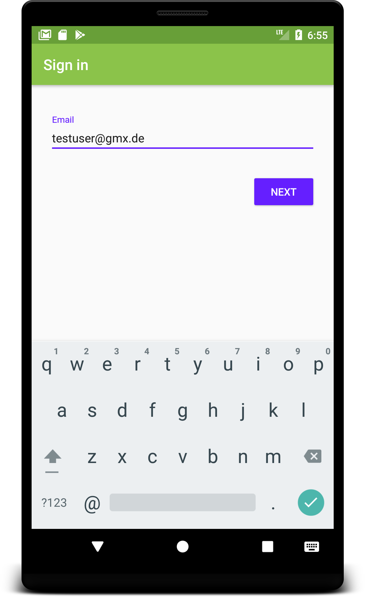
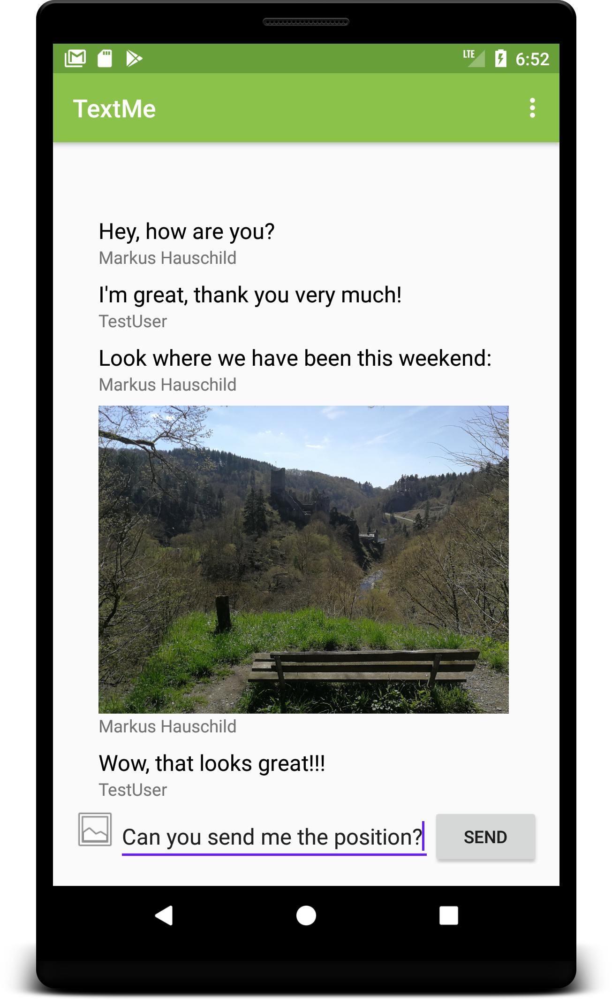

# TextMe

TextMe is a simple chat app for Android. The user has to sign in with
an e-mail address and is then able to write messages and send photos
to other users.

The app makes use of a number of Google Firebase Services like Authentification,
Database, Storage and Analytics. Via Firebase RemoteConfig parameters like
the message length limit can be changed easily.

